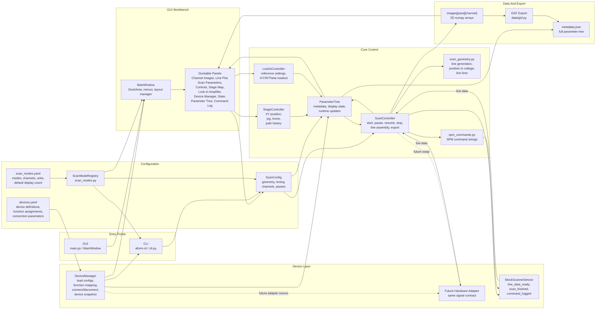
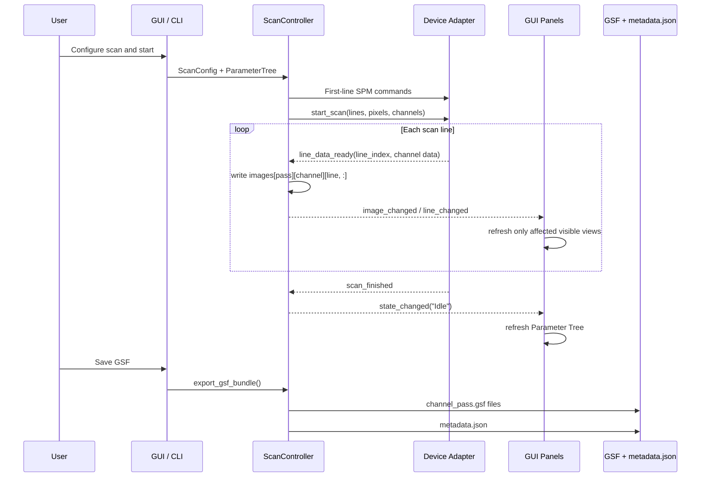
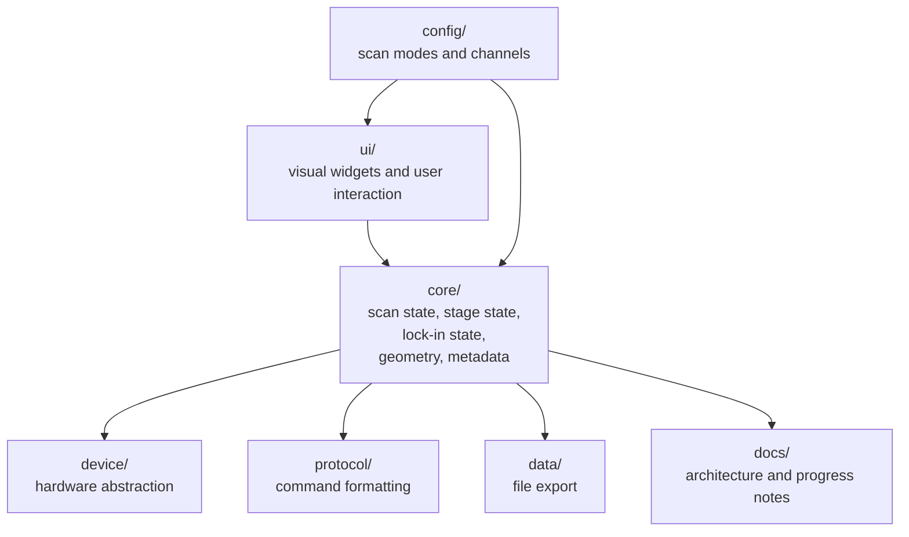

# AFM GUI Architecture Diagram

```mermaid
flowchart LR
    subgraph Entry["Entry Points"]
        GUI["GUI\nmain.py / MainWindow"]
        CLI["CLI\nafmm-cli / cli.py"]
    end

    subgraph UI["GUI Workbench"]
        MainWindow["MainWindow\nDockArea, menus, layout manager"]
        Panels["Dockable Panels\nChannel Images, Line Plot,\nScan Parameters,\nControls, Stage Map,\nLock-in Amplifier,\nDevice Manager, State,\nParameter Tree, Command Log"]
    end

    subgraph Config["Configuration"]
        ModesYaml["scan_modes.yaml\nmodes, channels, units,\ndefault display count"]
        DevicesYaml["devices.yaml\ndevice definitions,\nfunction assignments,\nconnection parameters"]
        ScanModes["ScanModeRegistry\nscan_modes.py"]
        ScanConfig["ScanConfig\ngeometry, timing,\nchannels, passes"]
    end

    subgraph Core["Core Control"]
        ParameterTree["ParameterTree\nmetadata, display state,\nruntime updates"]
        Controller["ScanController\nstart, pause, resume, stop,\nline assembly, export"]
        StageController["StageController\nXY position,\njog, home,\npath history"]
        LockInController["LockInController\nreference settings,\nX/Y/R/Theta readout"]
        Geometry["scan_geometry.py\nline generation,\nposition to voltage,\nline time"]
        Commands["spm_commands.py\nSPM command strings"]
    end

    subgraph Device["Device Layer"]
        DeviceManager["DeviceManager\nload configs,\nfunction mapping,\nconnect/disconnect,\ndevice snapshot"]
        MockDevice["MockScannerDevice\nline_data_ready,\nscan_finished,\ncommand_logged"]
        FutureHardware["Future Hardware Adapter\nsame signal contract"]
    end

    subgraph Data["Data And Export"]
        Images["images[pass][channel]\n2D numpy arrays"]
        GSF["GSF Export\ndata/gsf.py"]
        Metadata["metadata.json\nfull parameter tree"]
    end

    GUI --> MainWindow
    MainWindow --> Panels
    Panels --> ScanConfig
    CLI --> ScanConfig

    ModesYaml --> ScanModes
    DevicesYaml --> DeviceManager
    ScanModes --> MainWindow
    DeviceManager --> MainWindow
    ScanModes --> CLI
    DeviceManager --> CLI
    ScanModes --> ScanConfig

    ScanConfig --> ParameterTree
    ScanConfig --> Controller
    ParameterTree --> Controller
    StageController --> ParameterTree
    LockInController --> ParameterTree
    Panels --> StageController
    Panels --> LockInController
    Controller --> Geometry
    Controller --> Commands

    Commands --> MockDevice
    Controller --> MockDevice
    DeviceManager -. future adapter source .-> FutureHardware
    Controller -. future swap .-> FutureHardware

    MockDevice -- line data --> Controller
    FutureHardware -- line data --> Controller

    Controller --> Images
    Images --> Panels
    Controller --> ParameterTree
    ParameterTree --> Panels
    DeviceManager --> ParameterTree

    Images --> GSF
    ParameterTree --> Metadata
    GSF --> Metadata
```

## Runtime Data Flow

```mermaid
sequenceDiagram
    participant User
    participant GUI as GUI / CLI
    participant Ctrl as ScanController
    participant Dev as Device Adapter
    participant View as GUI Panels
    participant Export as GSF + metadata.json

    User->>GUI: Configure scan and start
    GUI->>Ctrl: ScanConfig + ParameterTree
    Ctrl->>Dev: First-line SPM commands
    Ctrl->>Dev: start_scan(lines, pixels, channels)

    loop Each scan line
        Dev-->>Ctrl: line_data_ready(line_index, channel data)
        Ctrl->>Ctrl: write images[pass][channel][line, :]
        Ctrl-->>View: image_changed / line_changed
        View->>View: refresh only affected visible views
    end

    Dev-->>Ctrl: scan_finished
    Ctrl-->>View: state_changed("Idle")
    View->>View: refresh Parameter Tree

    User->>GUI: Save GSF
    GUI->>Ctrl: export_gsf_bundle()
    Ctrl->>Export: channel_pass.gsf files
    Ctrl->>Export: metadata.json
```

## Module Boundary Summary

```mermaid
flowchart TB
    UI2["ui/\nvisual widgets and user interaction"]
    Core2["core/\nscan state, stage state,\nlock-in state,\ngeometry, metadata"]
    Device2["device/\nhardware abstraction"]
    Protocol2["protocol/\ncommand formatting"]
    Data2["data/\nfile export"]
    Config2["config/\nscan modes and channels"]
    Docs2["docs/\narchitecture and progress notes"]

    UI2 --> Core2
    Config2 --> UI2
    Config2 --> Core2
    Core2 --> Device2
    Core2 --> Protocol2
    Core2 --> Data2
    Core2 --> Docs2
```
